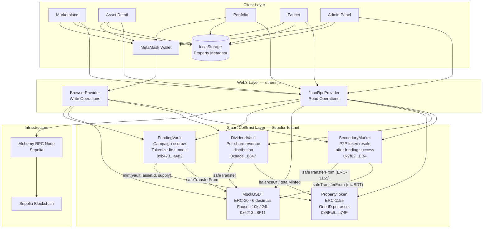
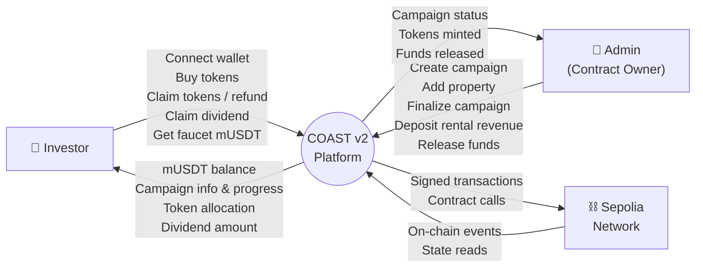
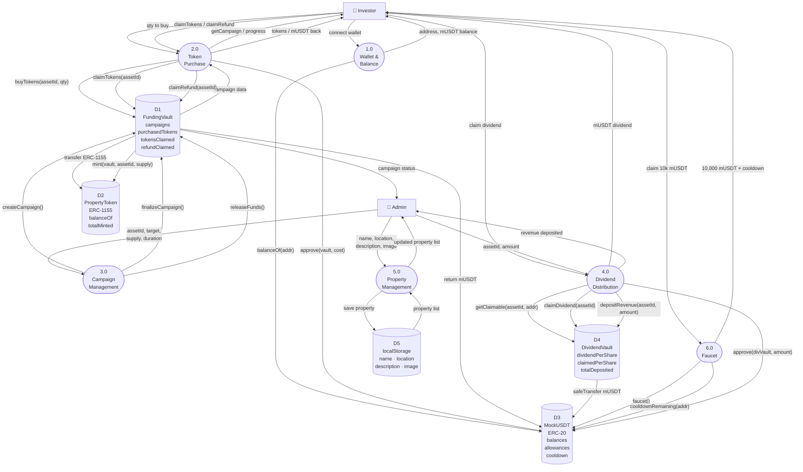

# COAST v2 — System Diagrams

---

## 1. Architecture Diagram

---

## 2. DFD Level 0 — Context Diagram

---

## 3. DFD Level 1

---

## Contract Address Reference

| Contract | Address |
|---|---|
| MockUSDT | `0x6213C1C7Ca089623E86476D43F5b30631eDf8F11` |
| PropertyToken | `0xBEc97F0798F74E8eC876a4396ffF5514c86aa74F` |
| FundingVault | `0xb473FC818A6D06Eb4bde6309b4d482285F59a482` |
| DividendVault | `0xaace8Fd6eF4c93e193C8e38204c78f6aacDf8347` |

Network: **Sepolia Testnet** · RPC: Alchemy · Frontend: Next.js 16 (App Router) · Web3: ethers.js v6
